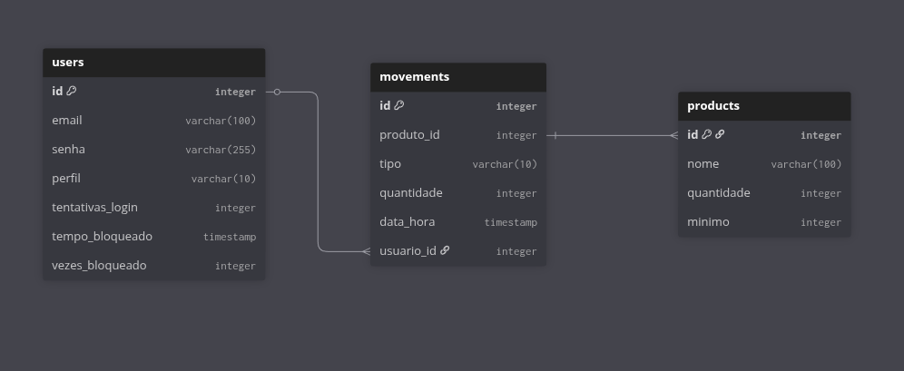
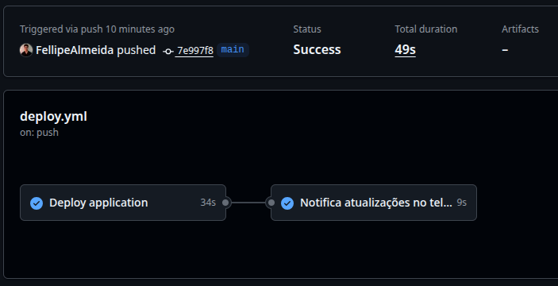

# Sistema de Controle de Estoque

Trabalho final do segundo semestre do curso de Análise e Desenvolvimento de Sistemas.

## Tecnologias

- **Node.js** (*Backend*)
- **Express** (*Framework API*)
- **PostgreSQL** (*Banco de dados*)
- **JWT** (*Autenticação e Controle de acesso*)

## Organização do Projeto

```
Express-API/
    .github/
        workflows/
            deploy.yml
    Backend/
        app/
            routers/
                users.routers.js
            database.js
            Dockerfile
            seed.js
            server.js
            config.js
    .env-example
    docker-compose.yml
    package.json
    README.md
    start.sh
```

## Diagrama do Banco de Dados



## Como rodar o projeto

### Clonar projeto 

```
git clone <url do projeto>
```

### Criar .env na raiz do projeto

```
SECRET_KEY=...
POSTGRES_USER=...
POSTGRES_PASSWORD=...
POSTGRES_DB=...
POSTGRES_HOST=...
PORT=...

ps: pode definir as variaveis da forma que quiser!
```

### Comando docker

```
docker compose up -d --build
```

### Comando docker para derrubar

```
docker compose down
```

### Comando docker para apagar tudo (volumes, containers, networks etc)

```
docker rm -f $(docker ps -aq)
docker volume rm $(docker volume ls -q)
docker system prune -a --volumes
```

### Para recriar

```
docker compose up -d --build
```

### Serviços
```
Api: localhost:5000
Adminer: localhost:8000
```

## Adicionais para Estudo:

### Faz o deploy e notifica no telegram
