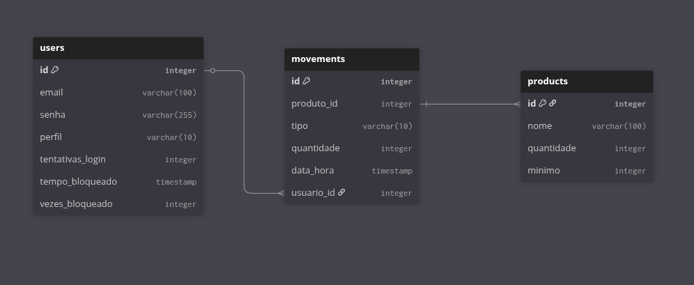
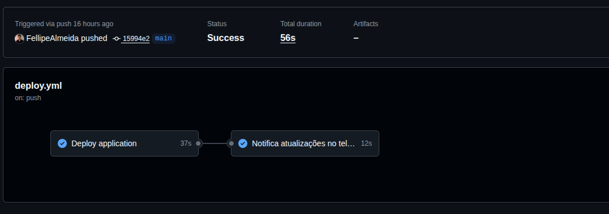

# Sistema de Controle de Estoque

Sistema de Controle de Estoque envolvendo todas as tecnologias que um sistema web precisa.

## Ferramentas

- **Node.js** (*Backend*)
- **Express** (*Framework API*)
- **PostgreSQL** (*Banco de dados*)
- **JWT** (*Autenticação e Controle de acesso*)
- **Github Actions** (*Integração contínua*)
- **Docker** (*Conteinarização*)

## Organização do Projeto

```
Express-API/
    .github/
        workflows/
    Backend/
        app/
            config/
            controllers/
            database/
            middlewares/
            routes/
            services/
            migrations.js
            server.js
        Dockerfile
        package-lock.json
        package.json
        start.sh
    Frontend/
        pages/
        scripts/
        styles/
        Dockerfile
        index.html
    .env-example
    .gitignore
    docker-compose.yml
    README.md
```

## Diagrama do Banco de Dados



## Como rodar o projeto

Certifique-se de ter o Docker instalado!

### Clonar projeto 

```
git clone <url do projeto>
```

### Criar .env na raiz do projeto

```
SECRET_KEY='sua_chave_secreta'
POSTGRES_USER=admin
POSTGRES_PASSWORD=1234
POSTGRES_DB=db
POSTGRES_HOST=db
PORT_DB=5432 
```

### Comando docker para rodar o projeto

```
docker compose up -d --build
```

Pronto! O projeto já está rodando na sua máquina.

## Comandos Docker

### Comando docker para derrubar

```
docker compose down
```

### Comando docker para apagar tudo (volumes, containers, networks etc)

```
docker rm -f $(docker ps -aq)
docker volume rm $(docker volume ls -q)
docker system prune -a --volumes
```

### Para recriar

```
docker compose up -d --build
```

### Serviços
```
Api: localhost:5000
Adminer: localhost:8000
Front: localhost:5500
```

## Funcionalidades
- Autenticação e autorização com tokens JWT
- Sistema de perfis de usuários (admin, estoquista, consultor) 
- Controle de tentativas de login
- Bloqueio automático por tentativas inválidas
- Cadastro de usuários
- Registro de movimentações (entrada e saida)
- Registro de produtos
- Edição de Produtos e Usuários
- Listagem de Produtos, Usuários e movimentações
- Busca de Produtos por id
- Deleção de produtos por id
- Geração de relatório

## Arquitetura
O projeto segue padrão em camadas:

### Backend

- Rotas -> Recebem requisições
- Controllers -> Trata requisições 
- Services -> Regras de negócio
- Database -> Conexão com o banco

### Frontend

- Pages -> Interfaces
- Scripts -> Lógica e integração com API
- Styles -> Estilização


## Integração Contínua:

### Github Actions
#### Faz o deploy e notifica no telegram


## Dados do banco

O banco já começa com alguns dados populados. Sendo eles um usuário de cada perfil (admin, estoquista, consultor) e 3 produtos.

### Usuário 1 - Admin

Credenciais:

- Email: admin@email.com
- Senha: 123

### Usuário 2 - Consultor

Credenciais:

- Email: consultor@email.com
- Senha: 123

### Usuário 3 - Estoquista

Credenciais:

- Email: estoquista@email.com
- Senha: 123
